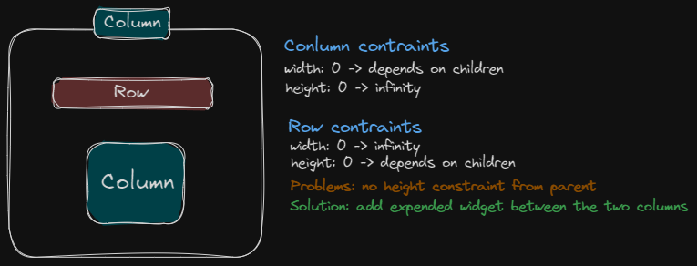

###### In this module we wil see...

# Interactivity, Theming, Responsive & Adaptive Apps

### 1 - Making Apps More Interactive & Esier To Style

- Using Modals, Dialogs & More
- Basic User Input Handling
- Configuring & Using App Themes

### 2 - Adapting Apps For Different Screen Sizes & Plataforms

- Changing Layouts Bases On Screen Sizes
- Detecting & Using Screen and Plataform Information
- Building Adaptive Widgets

# Understanding Widget Size Constraints

Widgets get sized bases on their **size preferences** & parent widget **size constraints**

