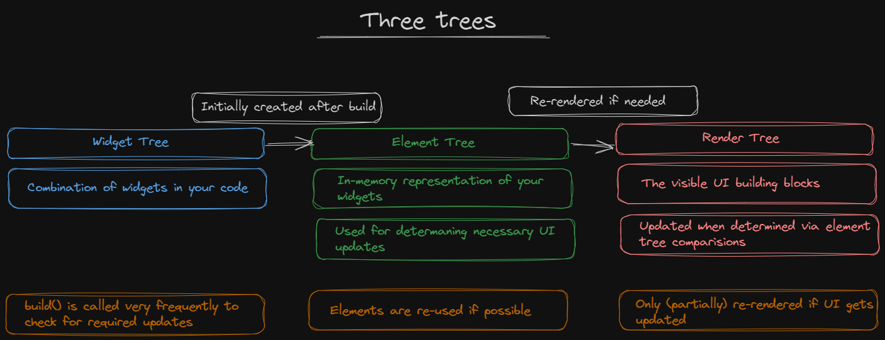
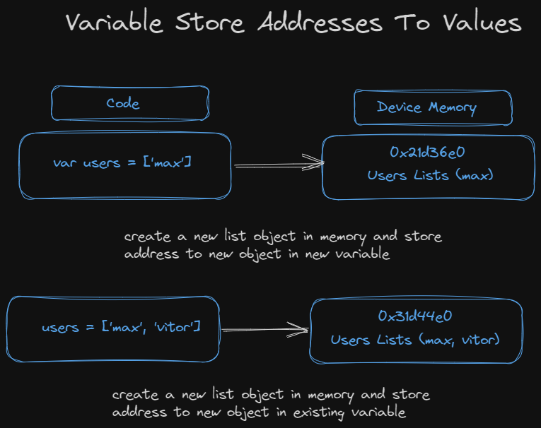

# Keys

As "keys" no Flutter são um conceito importante usado para identificar e diferenciar entre widgets em uma árvore de widgets. Aqui estão algumas razões importantes para usar keys no Flutter:

1. **Identificação única de widgets:** As keys são úteis quando você precisa identificar um widget de maneira única em uma árvore de widgets. Por exemplo, se você tiver uma lista de itens e desejar que o Flutter saiba qual deles foi alterado ou removido, pode usar keys para alcançar isso.
2. **Otimização de desempenho:** O Flutter usa keys para rastrear eficientemente os widgets na árvore e otimizar o desempenho ao atualizar o conteúdo da interface do usuário. Isso é especialmente importante ao trabalhar com listas ou conjuntos de widgets dinâmicos.
3. **Animações e transições suaves:** Ao usar keys adequadamente, você pode obter animações e transições mais suaves e previsíveis, pois o Flutter pode identificar facilmente os widgets que devem ser movidos ou alterados de estado.
4. **Integração com formulários e entradas de usuário:** Em formulários e entradas de usuário, as keys podem ajudar a garantir que os widgets mantenham seu estado corretamente, mesmo quando a ordem da lista muda.
5. **Evitar reconstruções desnecessárias:** Sem keys, o Flutter poderia reconstruir widgets em uma árvore mesmo que não seja necessário. Ao usar keys, você pode indicar ao Flutter que mantenha certos widgets intactos, a menos que seja absolutamente necessário reconstruí-los, o que pode melhorar o desempenho de seu aplicativo.

Resumindo, as keys no Flutter são uma ferramenta poderosa que permite controlar a identificação e o comportamento dos widgets em seu aplicativo, o que pode levar a um melhor desempenho e uma interface do usuário mais fluida e otimizada. No entanto, é importante usá-las com cuidado e apenas quando necessário, pois o uso incorreto de keys pode levar a problemas difíceis de depurar.

### Understanding final

---

Uma variável final é uma constante em tempo de compilação, o que significa que seu valor deve ser conhecido em tempo de compilação ou definido uma única vez durante a inicialização do objeto, como em um construtor.

```
final numbers = [1, 2, 3];
number.add(4);
```

O código acima funciona porque não estamos atribuindo um novo valor para "numbers". O que estamos fazendo é usando a lista existente em memória e adicionando um novo valor para ela.

```
final numbers = [1, 2, 3];
numbers = [1, 2];
```

Já o código acima geraria um erro, pois estamos atribuindo um novo valor para uma variável final.


